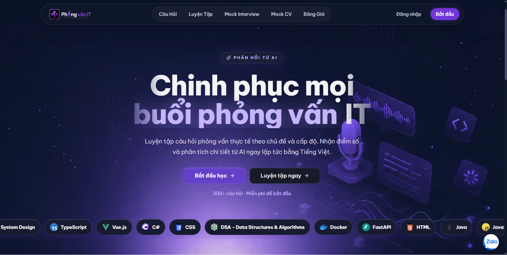
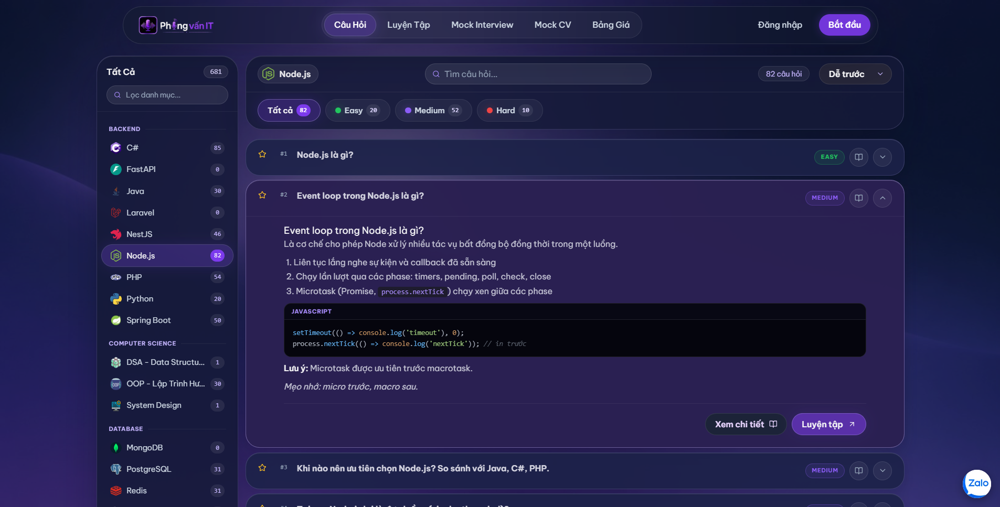
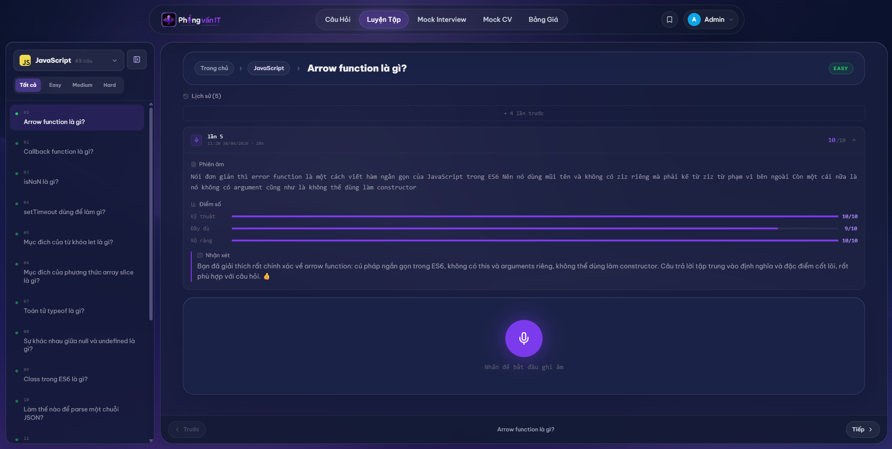
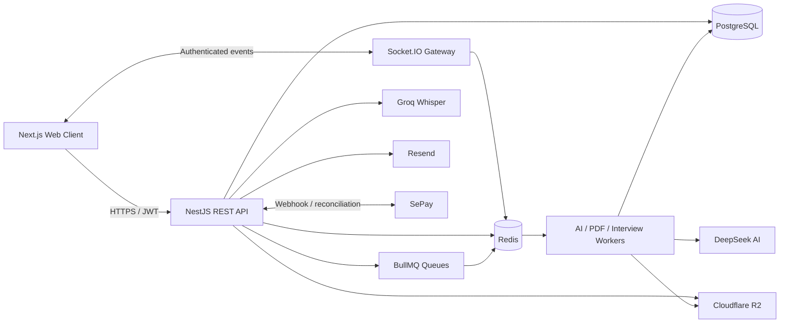
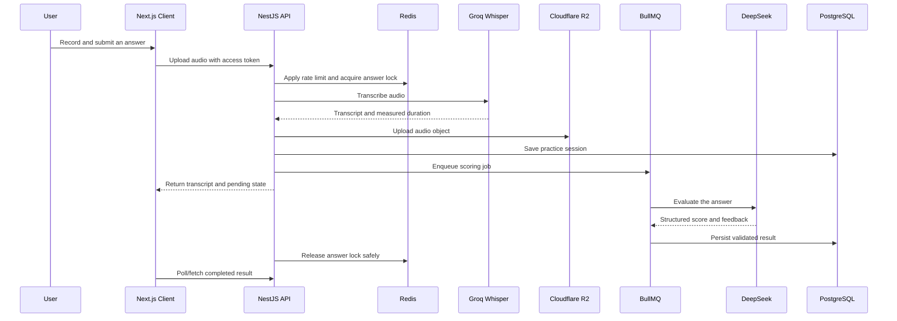
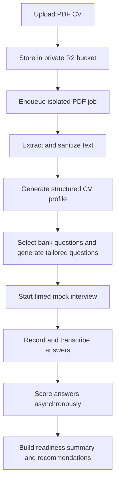
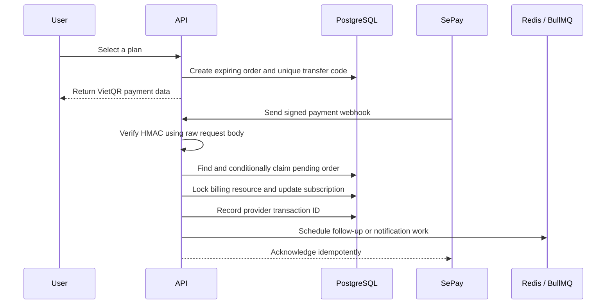

# IT Interview Practice Platform

> A Vietnamese interview-preparation platform that combines structured technical learning, voice-based practice, AI evaluation, personalized mock interviews, and subscription management in one full-stack application.


## Overview

IT Interview Practice Platform is designed for Vietnamese software developers who want more than a static question bank. It combines guided learning with realistic speaking practice: users select a technical topic, answer questions using their microphone, receive a transcript, and get structured AI feedback on technical accuracy, completeness, and clarity.

The platform also supports timed mock interviews and CV-based interview preparation. A user can upload a CV, let the system extract relevant experience and skills, generate a personalized interview plan, and review strengths, weaknesses, and next-step recommendations after completing the session.

This project is an npm-workspaces monorepo with a Next.js client and a NestJS API. Its backend emphasizes asynchronous processing, concurrency control, idempotent financial workflows, revocable authentication sessions, and operational tooling for administrators.

> **Project status:** Core product features are implemented. Security hardening, dependency review, production verification, and deployment are currently in progress. This repository is not yet presented as production-ready.

## Screenshots

### Landing page



### Searchable technical question bank



### Voice practice and AI evaluation



## Table of Contents

- [Core Features](#core-features)
- [Technical Highlights](#technical-highlights)
- [System Architecture](#system-architecture)
- [Key Backend Workflows](#key-backend-workflows)
- [Technology Stack](#technology-stack)
- [Repository Structure](#repository-structure)
- [Getting Started](#getting-started)
- [Environment Configuration](#environment-configuration)
- [Database Setup](#database-setup)
- [Available Commands](#available-commands)
- [Security and Reliability](#security-and-reliability)
- [Current Status](#current-status)
- [Author](#author)
- [License](#license)

## Core Features

### Learning and question bank

- Browse interview questions by technical category and difficulty.
- Search, filter, bookmark, and review detailed answers with formatted code examples.
- Track previous practice attempts and revisit saved questions.
- Manage topics, questions, technical terms, and learning content from the admin application.

### Voice-based AI practice

- Record and submit spoken answers directly from the browser.
- Transcribe audio through Groq Whisper.
- Evaluate answers with DeepSeek across technical accuracy, completeness, and clarity.
- Identify matched and missing keywords.
- Generate focused feedback, improvement points, and a rewritten answer.
- Preserve practice history so users can compare repeated attempts.

### Mock interviews

- Create timed mock interviews by topic, difficulty, and duration.
- Record one answer per question under interview deadlines.
- Automatically submit expired interviews and score answers asynchronously.
- Aggregate per-question results into an overall score, strengths, weaknesses, and recommendations.
- Allow failed scoring operations to be retried without duplicating completed work.

### CV-based interview preparation

- Upload a PDF CV to private object storage.
- Extract and sanitize text before AI analysis.
- Detect technical domains, experience signals, strengths, gaps, and claims that may need evidence.
- Combine question-bank content with AI-generated questions tailored to the CV.
- Run a dedicated CV-based interview and generate a readiness summary.
- Clean up stored CV objects through retryable background cleanup jobs.

### Accounts, subscriptions, and administration

- Register with email verification, sign in with password, or continue with Google OAuth.
- Recover passwords through email verification codes.
- Purchase a subscription through VietQR and SePay.
- Track subscription periods, AI usage, payment history, and renewal reminders.
- Provide administrators with user, content, interview, payment, subscription, support, and AI-result management tools.
- Support real-time user-to-admin messaging with optional image attachments.

## Technical Highlights

### BullMQ workers and asynchronous processing

Long-running or retryable work is moved out of the HTTP request lifecycle and processed through BullMQ queues backed by Redis. Dedicated workers handle AI scoring, answer improvement, PDF analysis, personalized question generation, interview overviews, and delayed mock-interview submission.

Workloads use configurable concurrency, deterministic job identifiers, retry policies, and recovery paths. PDF processing is isolated from general AI work so an expensive document cannot occupy all available AI workers.

### Redis as shared infrastructure

Redis is used for more than caching:

- BullMQ queue storage and coordination.
- Refresh-token allowlisting and immediate session revocation.
- Distributed locks around duplicate answer submissions.
- Shared rate-limit counters across API instances.
- WebSocket event throttling.
- Short-lived verification state and other expiring coordination data.

The local Redis service uses a `noeviction` policy to protect BullMQ's internal keys from being removed under memory pressure.

### Concurrency control and locking

Different race conditions are handled at the layer where they occur:

- **Optimistic claims:** conditional Prisma `updateMany` operations allow only one worker or request to move a record from an expected state to the next state.
- **PostgreSQL advisory locks:** transaction-scoped locks serialize billing, subscription, and final interview-write operations for the same logical resource.
- **Redis distributed locks:** `SET NX` with a TTL prevents concurrent audio submissions for the same interview question. A compare-and-delete Lua script ensures one request cannot release another request's lock.
- **Database constraints:** unique keys protect durable invariants such as provider transaction IDs, transfer codes, one score per session, and idempotency keys.

Together, these mechanisms reduce duplicate scoring, double credit consumption, repeated subscription activation, and answer/submit race conditions.

### Idempotent AI and payment operations

AI jobs use stable identifiers and state-based claims so retries can resume safely without overwriting completed results. Payment operations store the provider transaction ID and use conditional state transitions before activating a subscription.

SePay webhook processing is performed inside a transaction and coordinated with per-user billing locks. Replayed webhooks therefore return the existing result instead of granting the same benefits again.

### JWT authentication and RBAC

Authentication uses a two-token model:

- Short-lived JWT access tokens are sent as Bearer tokens.
- Refresh tokens are stored in an HTTP-only cookie.
- Every refresh token contains a unique `jti` registered in Redis.
- Refreshing rotates the token and invalidates the previous `jti`.
- Logging out removes the active device's refresh-token entry immediately.

Google ID tokens are verified by the API before the platform issues its own access and refresh tokens. Role-based guards separate user and administrator capabilities.

### Redis-backed rate limiting

NestJS Throttler uses a custom Redis storage implementation so limits remain consistent across multiple API instances. Atomic Lua operations update counters, expiration, and temporary block state in one step.

Different profiles are applied to authentication, verification codes, AI actions, audio uploads, administrator mutations, and WebSocket events. User-scoped limits are used where IP-only throttling would be insufficient.

### Real-time communication

Socket.IO powers the support channel between users and administrators. The WebSocket handshake is authenticated with a JWT, authorization is enforced for support threads, and Redis-backed throttling limits message events outside the HTTP guard pipeline.

### SePay payment workflow

The payment module creates expiring orders and VietQR payment instructions, matches incoming bank transfers by transfer code, verifies webhook signatures against the raw request body, and activates or extends subscriptions transactionally.

Administration features include payment history, revenue statistics, transaction export, manual grants, and reconciliation against SePay's transaction API.

### Object storage and cleanup

Cloudflare R2 stores uploaded audio, CV documents, and support attachments through its S3-compatible API. CVs are assigned to a private bucket. Storage cleanup records form a small outbox so database deletion can commit first and failed object deletion can be retried safely.

### Transactional email

Resend delivers account verification, password recovery, payment receipts, and subscription renewal reminders. Email templates escape user-provided values before rendering HTML.

## System Architecture



## Key Backend Workflows

### Voice answer evaluation



### CV-based mock interview



### SePay subscription activation



## Technology Stack

| Area | Technologies |
| --- | --- |
| Frontend | Next.js 16, React 19, TypeScript, Tailwind CSS 4 |
| Client state and data | Zustand, TanStack Query, Axios |
| Audio and visualization | Wavesurfer.js, Recharts, Motion |
| Backend | NestJS 11, TypeScript, Passport, Socket.IO |
| Database | PostgreSQL 16, Prisma 7 |
| Queue and coordination | Redis 7, BullMQ, ioredis |
| AI | Groq Whisper, DeepSeek |
| Storage | Cloudflare R2 via AWS S3 SDK |
| Authentication | JWT access/refresh tokens, Google OAuth 2.0 |
| Payments | VietQR and SePay webhooks/API |
| Email | Resend |
| Validation and security | Joi, class-validator, Helmet, NestJS Throttler |
| Local infrastructure | Docker Compose |

## Repository Structure

```text
.
├── apps/
│   ├── api/
│   │   ├── prisma/             # Schema, migrations, and seed data
│   │   └── src/
│   │       ├── common/         # Guards, filters, throttling, and shared utilities
│   │       ├── config/         # Validated application configuration
│   │       ├── modules/        # Domain modules and business logic
│   │       ├── queue/          # BullMQ connection setup
│   │       ├── redis/          # Shared Redis client
│   │       └── websocket/      # Authenticated Socket.IO gateway
│   └── web/
│       ├── public/             # Static frontend assets
│       └── src/
│           ├── app/            # Next.js App Router pages and layouts
│           ├── components/     # Product and admin UI components
│           ├── guards/         # Client route guards
│           ├── lib/            # API clients, stores, utilities, and WebSocket client
│           └── types/          # Shared frontend types
├── .github/readme-assets/      # README screenshots
├── docker-compose.dev.yml      # PostgreSQL and Redis for local development only
├── docker-compose.production.example.yml # Private-network reference, no public DB/Redis ports
├── package.json                # npm-workspaces scripts
└── README.md
```

The main backend domains include authentication, users, topics, questions, sessions, scoring, AI jobs, mock interviews, CV analysis, payments, subscriptions, credits, storage, email, support, and administration.

## Getting Started

### Prerequisites

- Node.js 22 LTS recommended
- npm
- Docker and Docker Compose
- A Google OAuth client ID
- Cloudflare R2 credentials and separate public/private buckets
- Groq and DeepSeek API keys
- Resend credentials
- SePay credentials if testing payment flows

### 1. Clone and install

```bash
git clone https://github.com/DaoDuck3008/Interview_Practice_Website.git
cd Interview_Practice_Website
npm install
```

### 2. Start PostgreSQL and Redis

```bash
docker compose -f docker-compose.dev.yml up -d
```

Local defaults:

| Service | Address |
| --- | --- |
| PostgreSQL | `localhost:5432` |
| Redis | `localhost:6380` |

### 3. Create environment files

Copy the provided examples:

```bash
cp apps/api/.env.example apps/api/.env
cp apps/web/.env.example apps/web/.env
```

On PowerShell:

```powershell
Copy-Item apps/api/.env.example apps/api/.env
Copy-Item apps/web/.env.example apps/web/.env
```

Fill in the required values described in [Environment Configuration](#environment-configuration). Never commit real credentials.

### Production infrastructure

`docker-compose.dev.yml` chỉ dành cho máy local và cố ý mở port để API chạy trên host kết nối được database/Redis. Không dùng file này cho production.

`docker-compose.production.example.yml` là mẫu cho trường hợp chạy hạ tầng bằng Docker: Postgres và Redis không publish port, chỉ nằm trong network nội bộ `backend`; API/worker production phải tham gia network này hoặc dùng private network tương đương của nền tảng deploy. Dù chưa tích hợp secret manager theo quyết định hiện tại, tuyệt đối không dùng password mặc định hay commit giá trị thật vào repository.

### 4. Generate the Prisma client and prepare the database

```bash
npm --workspace apps/api run prisma:generate
npm --workspace apps/api run prisma:migrate
npm --workspace apps/api run prisma:seed
```

### 5. Start the applications

Run the API and web client in separate terminals:

```bash
npm run api:dev
```

```bash
npm run web:dev
```

- Web application: `http://localhost:3000`
- REST API: `http://localhost:3001/api/v1`
- WebSocket namespace: `/ws`

## Environment Configuration

Use the checked-in `.env.example` files as the source of truth. The following table explains the main groups without exposing secret values.

### API (`apps/api/.env`)

| Variables | Purpose |
| --- | --- |
| `DATABASE_URL` | PostgreSQL connection string |
| `JWT_ACCESS_SECRET`, `JWT_REFRESH_SECRET` | JWT signing secrets |
| `JWT_ACCESS_EXPIRES_IN`, `JWT_REFRESH_EXPIRES_IN` | Token lifetimes |
| `GOOGLE_CLIENT_ID` | Server-side Google ID-token audience verification |
| `REDIS_URL` | BullMQ, locks, throttling, and refresh-token state |
| `FRONTEND_URL` | Allowed frontend origin |
| `R2_ACCOUNT_ID`, `R2_ACCESS_KEY_ID`, `R2_SECRET_ACCESS_KEY` | R2 API credentials |
| `R2_BUCKET_NAME`, `R2_PRIVATE_BUCKET_NAME`, `R2_PUBLIC_URL` | Object-storage configuration |
| `GROQ_API_KEY` | Speech-to-text transcription |
| `DEEPSEEK_API_KEY` | Scoring, feedback, and CV analysis |
| `SEPAY_API_KEY`, `SEPAY_WEBHOOK_SECRET` | Payment reconciliation and webhook verification |
| `SEPAY_BANK_ACCOUNT`, `SEPAY_BANK_CODE`, `SEPAY_ACCOUNT_NAME` | VietQR payment destination |
| `RESEND_API_KEY`, `MAIL_FROM` | Transactional email |
| `AI_QUEUE_CONCURRENCY` | General AI worker concurrency |

### Web (`apps/web/.env`)

| Variables | Purpose |
| --- | --- |
| `NEXT_PUBLIC_API_URL` | REST API base URL |
| `NEXT_PUBLIC_GOOGLE_OAUTH_CLIENT_ID` | Google sign-in client ID |
| `NEXT_PUBLIC_R2_PUBLIC_URL` | Public static object base URL |

## Database Setup

Prisma migrations are stored under `apps/api/prisma/migrations`. The schema covers:

- Users, authentication state, and roles.
- Hierarchical topics and interview questions.
- Practice sessions, transcripts, scores, and improvements.
- Topic-based and CV-based mock interviews.
- Plans, orders, subscriptions, credit cycles, and reservations.
- Support messages and favorites.
- Technical terms and generated explanations.
- Storage cleanup jobs and administrative audit records.

Useful commands:

```bash
npm --workspace apps/api run prisma:migrate
npm --workspace apps/api run prisma:seed
npm --workspace apps/api run prisma:studio
```

## Available Commands

Run these commands from the repository root unless noted otherwise.

| Command | Description |
| --- | --- |
| `npm run web:dev` | Start the Next.js development server |
| `npm run web:build` | Create the frontend production build |
| `npm run api:dev` | Start the NestJS API in watch mode |
| `npm run api:build` | Compile the API |
| `npm run api:test` | Run API unit tests |
| `npm --workspace apps/web run lint` | Lint the frontend |
| `npm --workspace apps/api run test:cov` | Run API tests with coverage |
| `docker compose -f docker-compose.dev.yml up -d` | Start local PostgreSQL and Redis |

## Security and Reliability

The current implementation includes:

- Password hashing with bcrypt.
- Short-lived access tokens and rotating, revocable refresh tokens.
- HTTP-only refresh-token cookies.
- Google ID-token verification on the server.
- RBAC guards for administrative endpoints.
- Global DTO validation with unknown-field rejection.
- Helmet security headers and explicit CORS configuration.
- Redis-backed IP and user rate limiting.
- Signed SePay webhook verification using the raw request body.
- Conditional state transitions, advisory locks, distributed locks, and unique constraints.
- Private storage for CV documents and retryable cleanup records.
- Audit-field redaction for sensitive transcript and audio data.

Security work is not treated as finished. A production-readiness review is in progress, covering dependency upgrades, webhook configuration, private media delivery, AI cost limits, upload validation, observability, recovery procedures, and deployment checks.

## Current Status

### Completed

- Core learning and question-bank flows.
- Voice recording, transcription, AI scoring, and answer improvement.
- Topic-based and CV-based mock interviews.
- Email/password and Google authentication.
- User and administrator applications.
- Subscription, credit, VietQR, webhook, and reconciliation flows.
- Real-time support messaging.
- Background AI/PDF processing and storage cleanup.

### In progress

- Production security hardening.
- Dependency and integration verification.
- Broader automated test coverage.
- Production observability and operational runbooks.
- Final production deployment.

## Author

**DaoDuck3008**

- GitHub: [github.com/DaoDuck3008](https://github.com/DaoDuck3008)

## License

No license has been granted for this repository. The project is published for portfolio and evaluation purposes only. All rights are reserved by the author.
